ifndef::imagesdir[:imagesdir: ../images]

[[section-glossary]]
== Annex I - Testing
To ensure reliable and frequent software releases, comprehensive testing is essential. Robust test coverage enables safe code refactoring, instills confidence in deployments, and maintains high standards of software quality.

=== Unit Test
The project utilizes JUnit 5 for isolated testing of individual application components, complemented by Spring Boot Test utilities to simulate the application's runtime behavior. The test classes are organized in the src/test/java/com/uniovi directory, with Wichat_UnitTests.java serving as the primary test suite for the service and repository layers.

=== Integration testing (E2E)
Behavior-Driven Development (BDD) principles guide our integration tests through Cucumber's Gherkin syntax, creating executable specifications in plain language. Selenium WebDriver automates browser interactions to simulate real user workflows. Feature definitions are stored in src/test/resources/features, with their implementations in src/test/java/com/uniovi/steps. The CucumberRunnerTests.java orchestrates these scenario validations.

=== Load test
We have implemented load tests to evaluate the performance of our website under extreme conditions. For this purpose, we utilize the Gatling application, which enables us to simulate a specified number of users making web requests simultaneously.

The load tests have been conducted with user loads of 10 and 1,000 users simultaneously, as well as ramping up to 200 users over 20 seconds and 2,000 users over 60 seconds. The following use cases were evaluated during these tests:

* **Login**: Assessing the performance and response time during user authentication.
* **Show Profile**: Evaluating the loading speed and responsiveness when users access their profiles.
* **Show API Key**: Testing the retrieval of API keys and ensuring secure access.
* **Play an Image Game**: Measuring performance while users engage with interactive content.
* **Show Global Image Ranking**: Analyzing the system's ability to display rankings under heavy load.
* **Change Language**: Testing the responsiveness of the application when users switch languages.
* **Log Out**: Assessing the efficiency of the logout process.

These load tests have been executed against both the locally deployed environment and the production-like environment hosted in a virtual machine on Microsoft Azure. This dual testing approach allows us to compare performance under controlled conditions and in a cloud-hosted infrastructure more similar to a real-world deployment.

By conducting these load tests, we aim to identify potential bottlenecks and ensure that our website can handle high traffic volumes effectively, providing a seamless experience for all users.

==== Login

===== Local deployment
.10 users at once
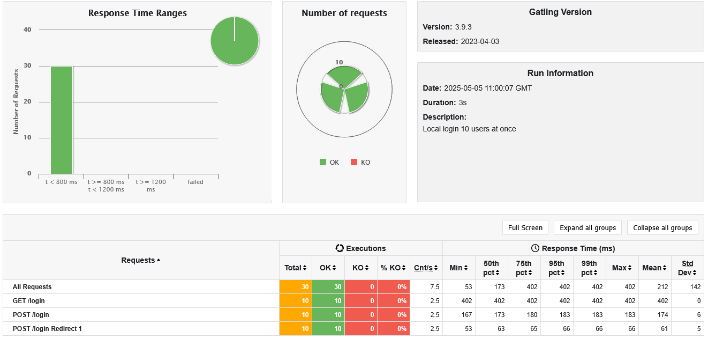

.1000 users at once
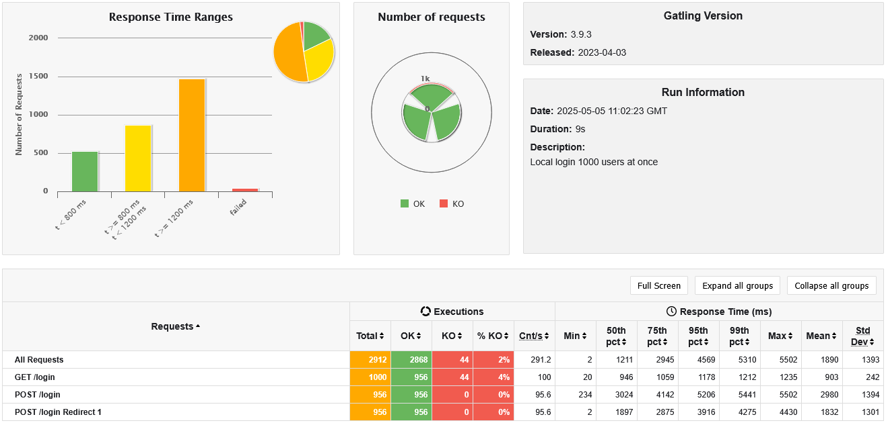

.200 users in 20 seconds
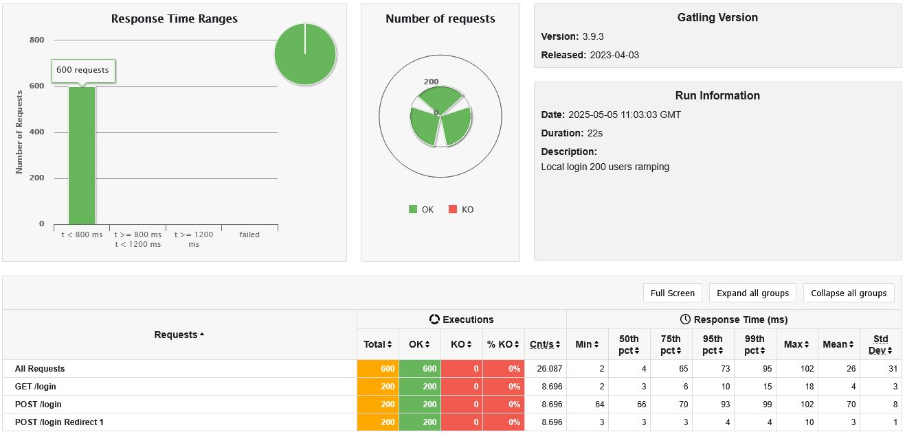

.2000 users in 60 seconds
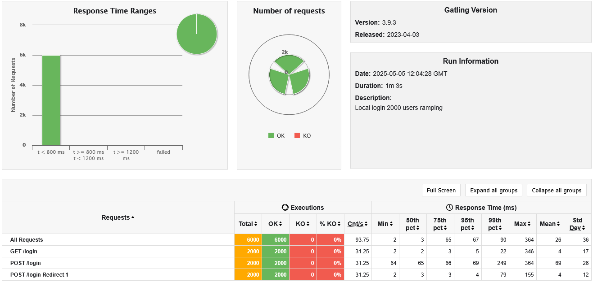

===== Cloud deployment
.10 users at once
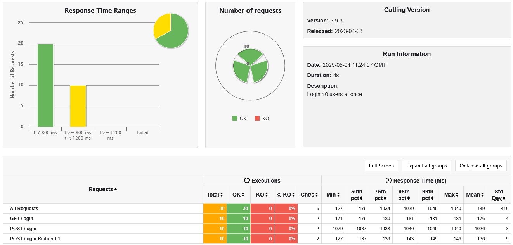

.1000 users at once
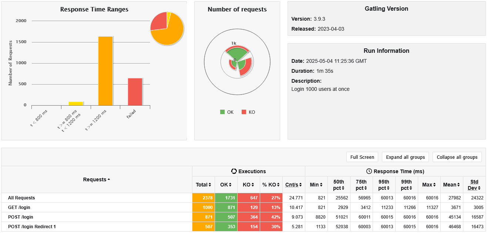

.200 users in 20 seconds
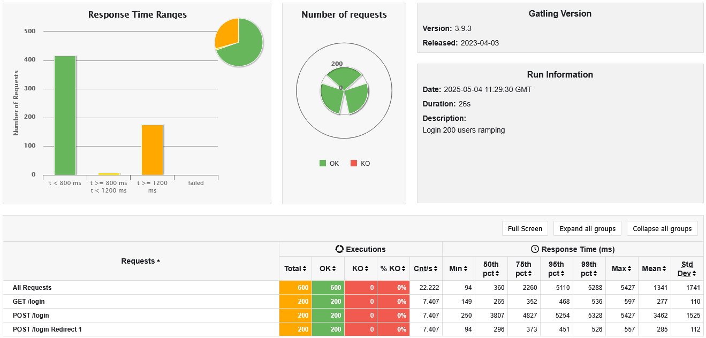

.2000 users in 60 seconds
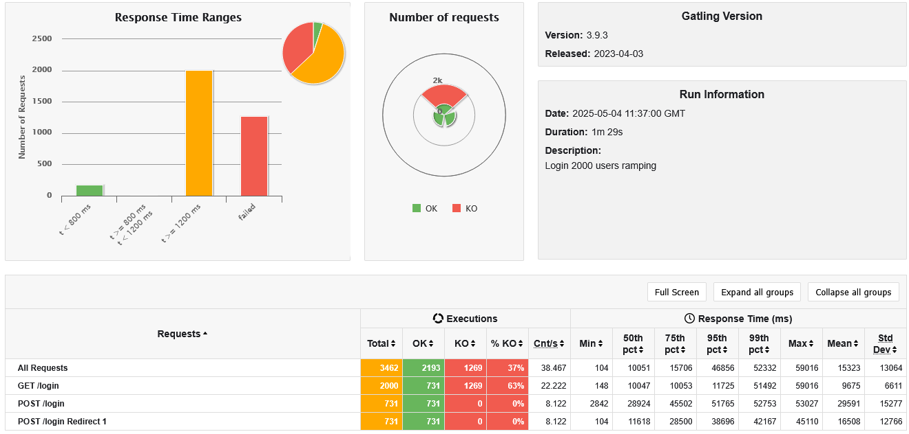

==== Show Profile
===== Cloud deployment
.10 users at once
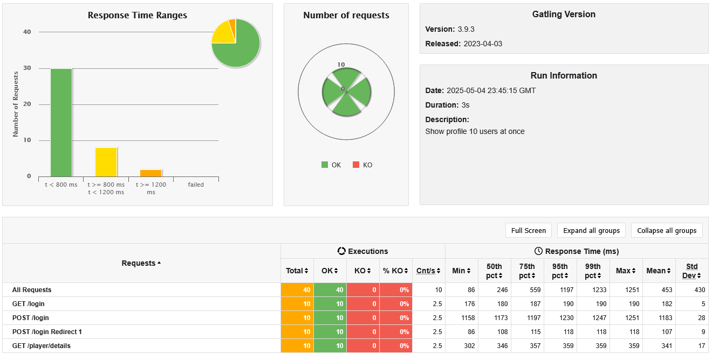

.1000 users at once
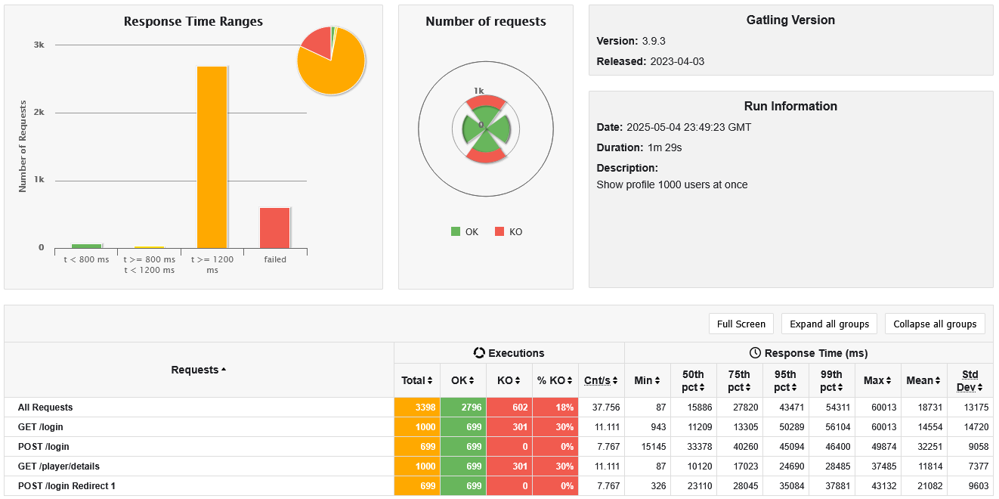

.200 users in 20 seconds
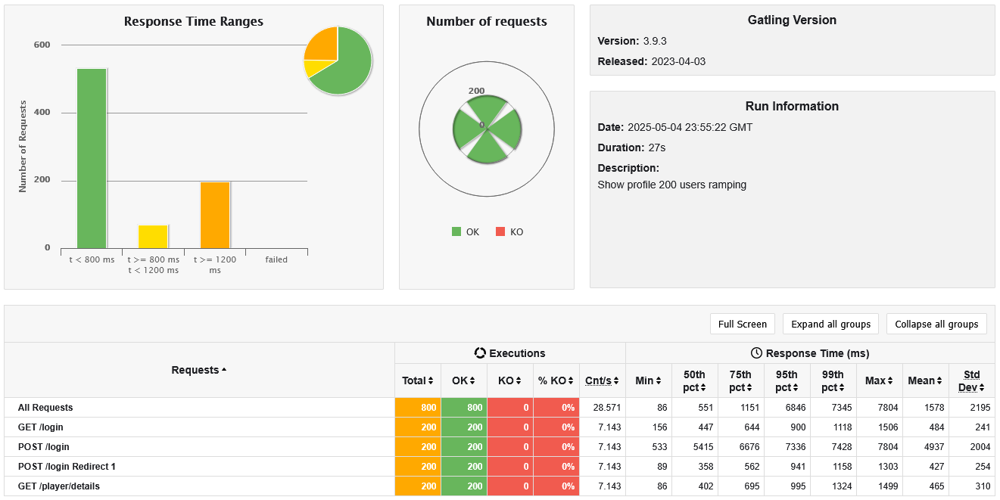

.2000 users in 60 seconds
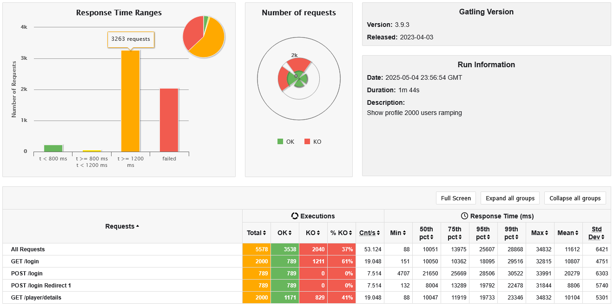

==== Show API Key
===== Local deployment
.10 users at once
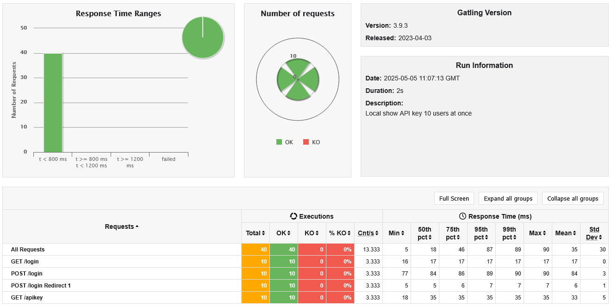

.1000 users at once
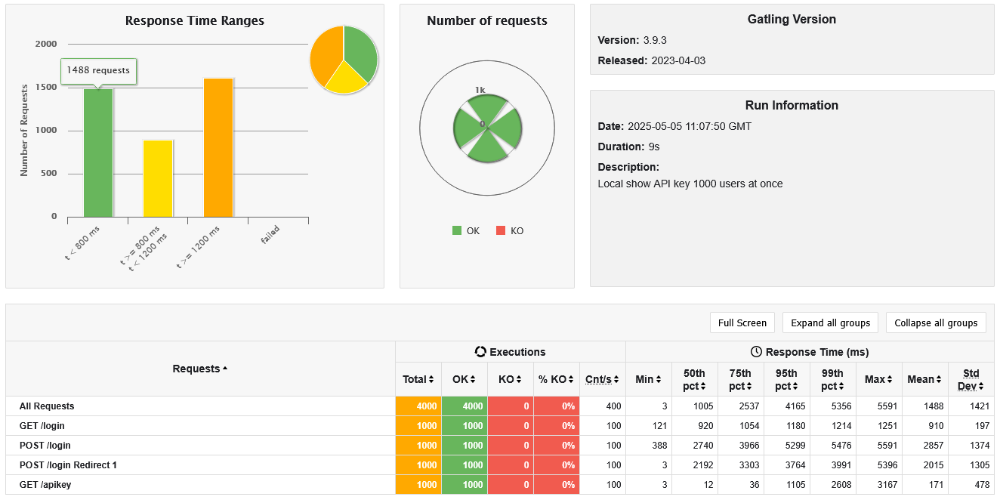

.200 users in 20 seconds
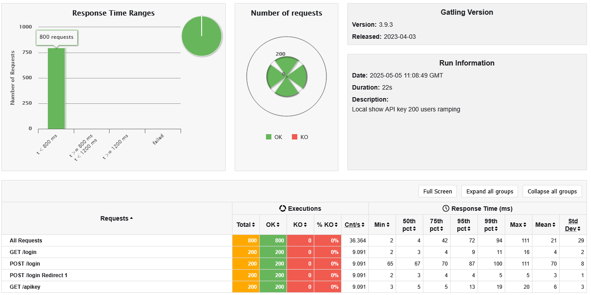

.2000 users in 60 seconds
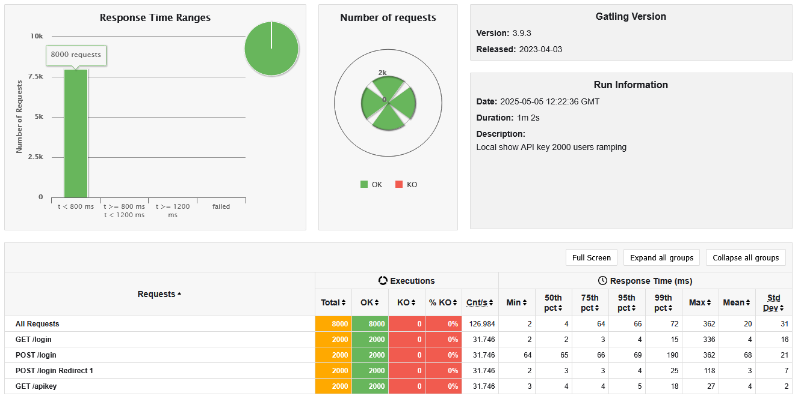

===== Cloud deployment
.10 users at once
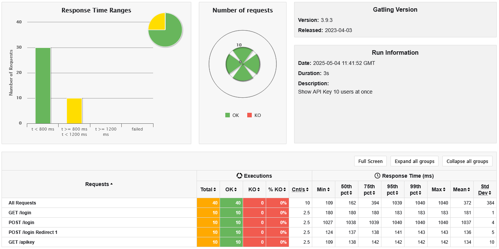

.1000 users at once
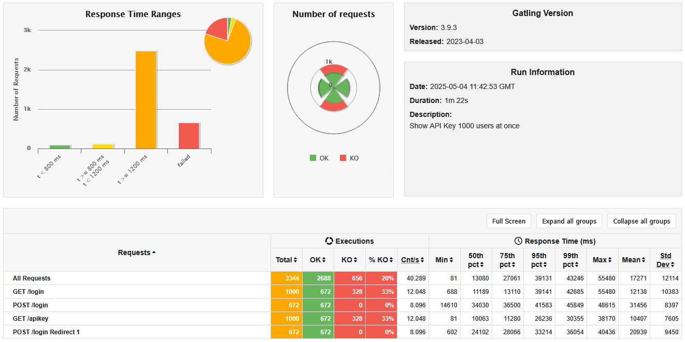

.200 users in 20 seconds
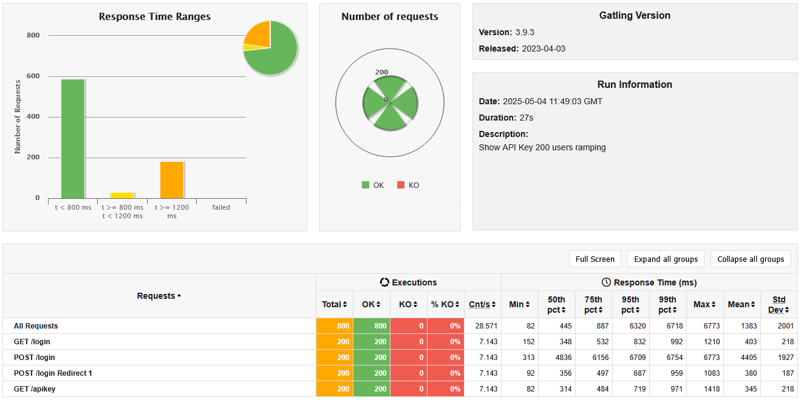

.2000 users in 60 seconds
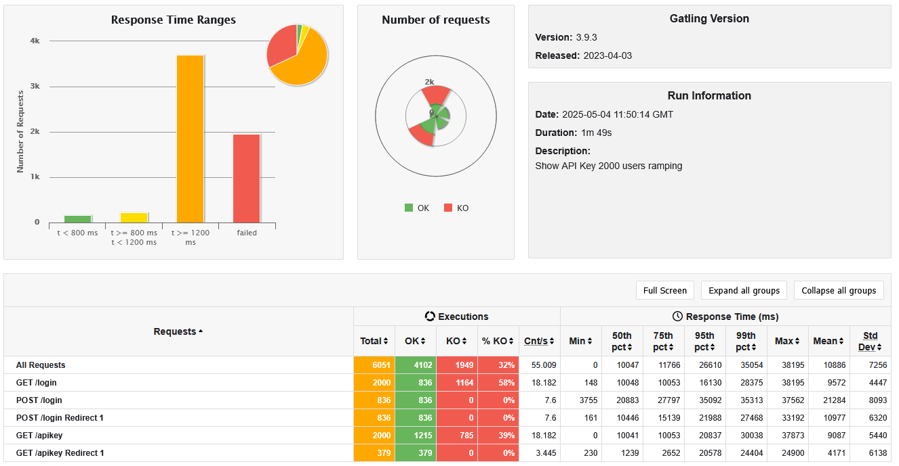